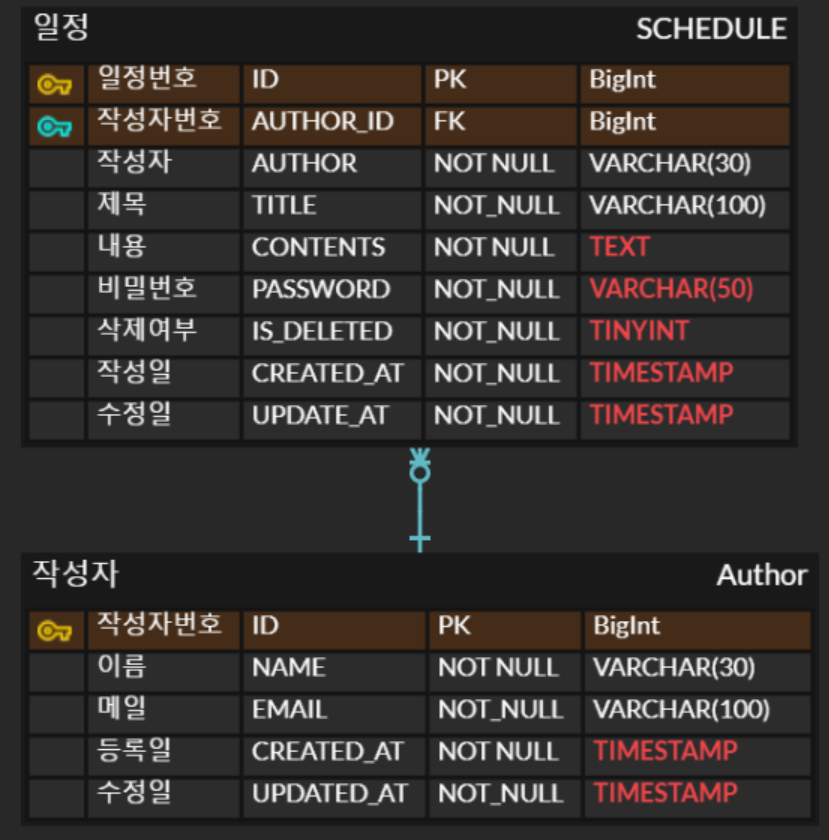

# 일정관리 프로젝트

## 개요
- 일정을 작성하고, 작성자가 입력한 `비밀번호`를 이용하여 작성된 `일정`을 수정 및 삭제할 수 있습니다.

## 프로젝트 목표
1. 일정 `생성` 및 `조회` 기능 구현
2. 일정을 수정 및 할 경우 `비밀번호`를 통해 작성자만 수정할 수 있도록 보호

## 주요 기능
### 일정 생성 및 관리
- 작성자가 `할일`, `비밀번호`를 입력 후 생성
- 작성된 일정을 전체, 상세 `조회` 기능 제공
- `비밀번호`를 통해 작성자 본인을 확인 후 처리 일정 `수정` 및 `삭제`

## API 명세서
swagger API 문서 : http://localhost:8080/swagger-ui/index.html

| 기능       | 메소드   | URL                | 요청       | 응답       | 상태코드      |
|----------|-------|--------------------|----------|----------|-----------|
| 일정등록     | POST  | api/schedules      | 요청 body  | 등록 정보    | 201: 정상등록 |
| 일정 전체 조회 | GET   | api/schedules      | 요청 param | 단건 응답 정보 | 200: 정상조회 |
| 일정 상세 조회 | GET   | api/schedules/{id} | 요청 param | 다건 응답 정보 | 200: 정상조회 |
| 일정 수정    | PATCH | api/schedules/{id} | 요청 body  | 수정 정보    | 200: 정상수정 |
| 일정 삭제    | PUT   | api/schedules/{id} | 요청 param  | -        | 200: 정상삭제 |


## ERD


## SQL
```sql
CREATE TABLE AUTHOR(
                       ID BIGINT AUTO_INCREMENT PRIMARY KEY COMMENT '작성 식별자',
                       NAME VARCHAR(30) NOT NULL COMMENT '이름',
                       EMAIL VARCHAR(100) NOT NULL COMMENT '메일',
                       CREATED_AT TIMESTAMP NOT NULL DEFAULT CURRENT_TIMESTAMP COMMENT '등록일',
                       UPDATED_AT TIMESTAMP NOT NULL DEFAULT CURRENT_TIMESTAMP ON UPDATE CURRENT_TIMESTAMP COMMENT '수정일'
);

CREATE TABLE SCHEDULE
(
    ID BIGINT AUTO_INCREMENT PRIMARY KEY COMMENT '일정관리 식별자' ,
    AUTHOR_ID BIGINT NOT NULL COMMENT '작성자 ID' ,
    TITLE VARCHAR(100) NOT NULL COMMENT '제목' ,
    CONTENTS TEXT COMMENT '내용',
    PASSWORD VARCHAR(50) NOT NULL COMMENT '비밀번호',
    IS_DELETED TINYINT NOT NULL DEFAULT 0 COMMENT '삭제 여부 (0: 활성, 1 : 삭제)' ,
    CREATED_AT TIMESTAMP NOT NULL DEFAULT CURRENT_TIMESTAMP COMMENT '등록일',
    UPDATED_AT TIMESTAMP NOT NULL DEFAULT CURRENT_TIMESTAMP ON UPDATE CURRENT_TIMESTAMP COMMENT '수정일',
    CONSTRAINT FK_SCHEDULE_AUTHOR
        FOREIGN KEY (AUTHOR_ID) REFERENCES AUTHOR(ID) ON DELETE CASCADE
);
```